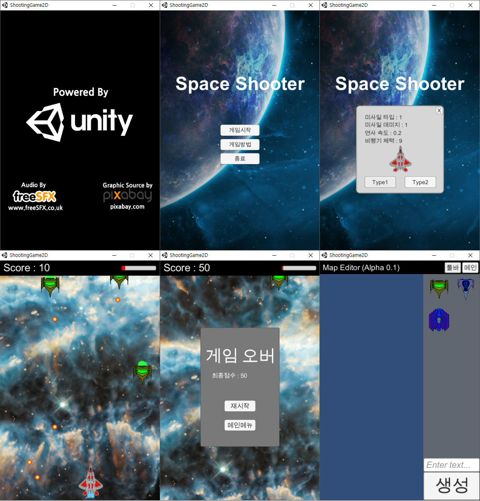

# Welcome to my "2D Shooting Game Project(using C#)"
## About this project
My School works project.
## What's New? (Last updated 2016.11.6)
```
 1) Implement game level2 design(Not complete)
 2) Fix bug(when enemy die, missile leak and stop attack)
 3) Optimize codes(little)
 4) Optimize game performance(Average FPS 81.2 -> Average FPS 1102 => More than 10 times better)
 5) Add new type enemy
```
## Next Updates
```
 1) Implement another game level design
 2) Optimize all codes
 3) Add weapon type
```
## Key Manual
```
 Up : Arrow Up
 Down : Arrow Down
 Left : Arrow Left
 Right : Arrow Right
 A : Fire
```
## Game ScreenShot

## Source Copyright
```
 Sprite Sources : https://pixabay.com/
 Sound Sources : http://www.freesfx.co.uk/
 (Reference Copyright folder)
```
## Good Bye!!
Compiled by Unity Personal 5.4.0f and Visual Studio 2015 C#
